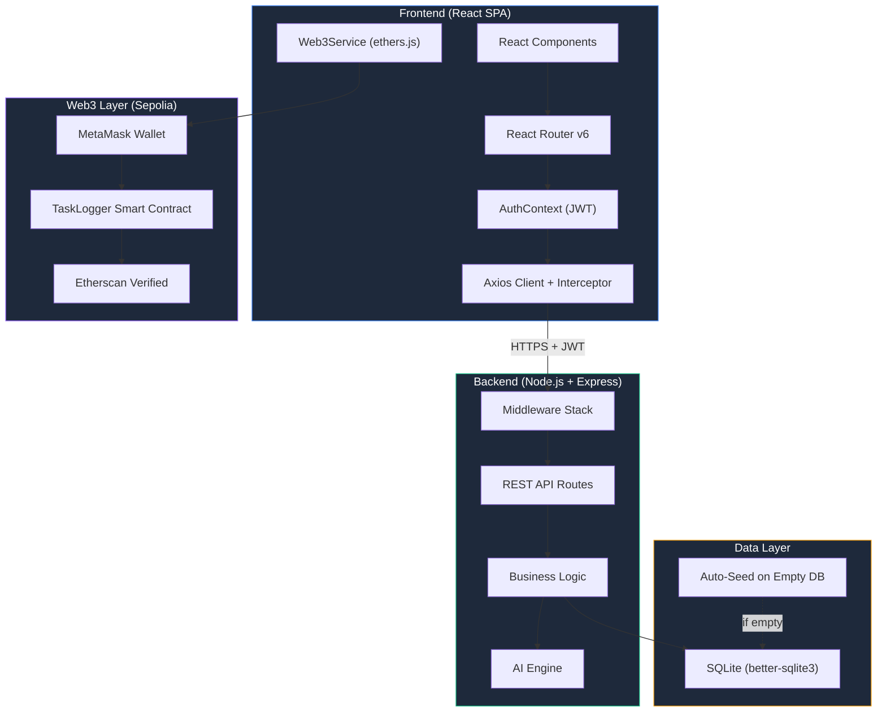
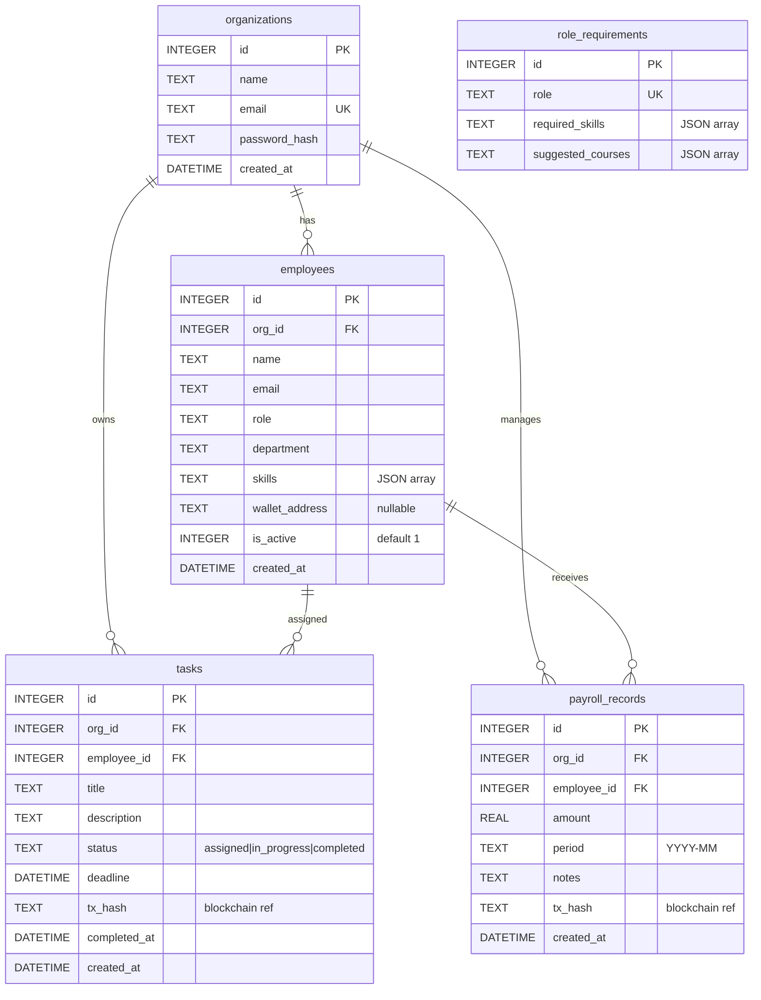
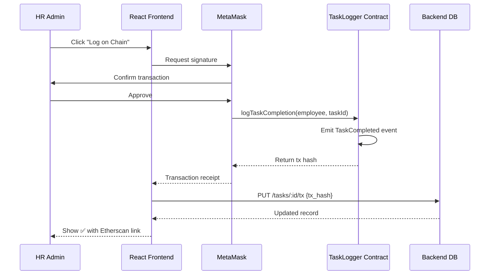

# RizeOS AI-HRMS — System Architecture

## High-Level Architecture



---

## Database Schema



### Performance Indexes
```sql
CREATE INDEX idx_employees_org ON employees(org_id);
CREATE INDEX idx_employees_dept ON employees(org_id, department);
CREATE INDEX idx_tasks_org ON tasks(org_id);
CREATE INDEX idx_tasks_employee ON tasks(employee_id);
CREATE INDEX idx_tasks_status ON tasks(org_id, status);
CREATE INDEX idx_tasks_completed ON tasks(org_id, completed_at);
CREATE INDEX idx_payroll_employee ON payroll_records(employee_id);
CREATE INDEX idx_payroll_org ON payroll_records(org_id);
```

---

## API Architecture

### Middleware Pipeline

```
Request → CORS → Helmet → Rate Limiter → JSON Parser → Auth (JWT) → Controller → Response
```

| Middleware | Purpose |
|---|---|
| **CORS** | Whitelist frontend origins (Vercel, localhost) |
| **Helmet** | Security headers (CSP, HSTS, X-Frame-Options) |
| **Rate Limiter** | 100 requests/15 min per IP (brute-force protection) |
| **express.json** | Parse JSON bodies (10kb limit) |
| **Auth middleware** | Verify JWT, inject `req.org` with org context |

### Route Map

| Route Group | Endpoints | Auth | Description |
|---|---|---|---|
| `/api/auth` | POST `/register`, `/login` | ❌ | JWT-based org authentication |
| `/api/employees` | CRUD + CSV export | ✅ | Employee lifecycle management |
| `/api/tasks` | CRUD + status transitions | ✅ | Workforce task tracking |
| `/api/dashboard` | GET `/stats`, `/task-trend`, `/dept-distribution` | ✅ | Aggregated analytics |
| `/api/ai` | 5 intelligence endpoints | ✅ | AI-powered workforce insights |
| `/api/analytics` | GET `/team-performance` | ✅ | Team-level analytics |
| `/api/payroll` | CRUD + tx hash storage | ✅ | Payroll record management |

### Multi-Tenant Isolation

Every query is scoped by `org_id` extracted from the JWT token:
```javascript
// Auth middleware injects org context
const org = jwt.verify(token, SECRET);
req.org = { id: org.id, name: org.name };

// Every controller query is org-scoped
const employees = db.prepare(
    'SELECT * FROM employees WHERE org_id = ?'
).all(req.org.id);
```

---

## AI Engine Architecture

### Module 1: Productivity Score
```
Input:  employee_id
Output: { score: 0-100, breakdown, rating }

Algorithm:
  completion_rate  = (completed / total) × 100           [40%]
  timeliness       = (on_time / completed) × 100         [30%]
  speed            = avg days (created → completed)      [20%]
  consistency      = 1 - stddev(weekly_completions)/mean  [10%]

  final_score = weighted_sum(above)
  rating = excellent (≥80) | good (≥60) | average (≥40) | needs_improvement (<40)
```

### Module 2: Skill Gap Detection
```
Input:  employee_id
Output: { matchPercentage, missingSkills[], suggestedCourses[] }

Process:
  1. Load employee skills (JSON array)
  2. Load role_requirements for employee's role
  3. Compute set difference: required - current = missing
  4. Return match %, missing list, and curated course suggestions
```

### Module 3: Smart Task Assignment
```
Input:  { title, requiredSkills[] }
Output: top 3 employees ranked by composite score

Composite = (skill_match × 0.5) + (workload_avail × 0.3) + (productivity × 0.2)

  skill_match:  |intersection(emp.skills, required)| / |required|
  workload:     inverse of active task count (assigned + in_progress)
  productivity: historical completion rate
```

### Module 4: Performance Trend Prediction
```
4-week rolling window with weekly completion counts:
  [week1, week2, week3, week4]

  recent_avg = avg(week3, week4)
  older_avg  = avg(week1, week2)
  delta      = recent_avg - older_avg

  trend = "improving" if delta > 0, "stable" if 0, "declining" if < 0
```

---

## Web3 Integration Architecture



### Smart Contract Details
| Property | Value |
|---|---|
| **Contract** | `TaskLogger.sol` |
| **Network** | Ethereum Sepolia Testnet |
| **Address** | `0x2e2605F492B36b29F8388a610e180d46A8f5d77e` |
| **Compiler** | Solidity ^0.8.19 |
| **Verified** | ✅ Sourcify, Blockscout, Routescan |

### Fallback Strategy
If the smart contract is not deployed or the user has no MetaMask:
- Transactions are sent to the burn address (`0x...dEaD`) with encoded data
- This ensures on-chain proof exists even without a custom contract
- The app gracefully degrades — all features work without Web3

---

## Security Measures

| Layer | Measure | Implementation |
|---|---|---|
| **Transport** | HTTPS enforced | Vercel/Render TLS termination |
| **Headers** | Security headers | Helmet middleware (CSP, HSTS, X-Frame) |
| **Auth** | JWT tokens | 7-day expiry, bcrypt password hashing (10 rounds) |
| **Rate Limiting** | API throttling | 100 req/15min per IP |
| **Input** | Body size limit | 10KB JSON payload limit |
| **SQL Injection** | Parameterized queries | All DB queries use `?` placeholders |
| **CORS** | Origin whitelist | Only allowed frontend domains |
| **Multi-Tenant** | Data isolation | Every query scoped by `org_id` from JWT |

---

## Production Scaling Path

### Current (Demo/MVP)
- SQLite with WAL mode — zero-config, self-contained
- Single Node.js process
- Auto-seed on empty database for evaluator convenience

### 1K Employees
```diff
- SQLite (better-sqlite3)
+ PostgreSQL (Supabase/Neon) with connection pooling (pg-pool)
+ Database migrations with node-pg-migrate
```

### 10K Employees
```diff
+ Redis caching layer for dashboard stats (TTL: 5min)
+ Background job queue (BullMQ) for AI computations
+ Elasticsearch for full-text employee/skill search
```

### 100K Employees
```diff
+ Horizontal Node.js replicas behind load balancer
+ Read replicas for analytics queries
+ Materialized views for dashboard aggregations
+ CDN for static frontend assets
```

### 1M Task Logs
```diff
+ TimescaleDB hypertables for time-series task data
+ Partitioned tables by org_id + month
+ Streaming aggregation with Apache Kafka
+ The Graph indexer for on-chain event queries
```

### Cost-Efficient Blockchain at Scale
```diff
- Sepolia testnet (demo)
+ Polygon PoS (production) — $0.001/tx vs $2+ on Ethereum mainnet
+ Batch transactions — group 100 task logs into single tx
+ The Graph subgraph for indexed on-chain queries
```

---

## Why These Technology Choices?

| Decision | Rationale |
|---|---|
| **SQLite over PostgreSQL** | Zero-config demo deployment. Auto-seeds on empty DB so evaluators always see data. Migration path documented above. |
| **better-sqlite3 over sqlite3** | Synchronous API is 10x faster than async sqlite3 for simple queries. WAL mode enables concurrent reads. |
| **JWT over Sessions** | Stateless auth scales horizontally. No session store needed. |
| **Ethers.js v6 over Web3.js** | Smaller bundle, better TypeScript support, cleaner API. |
| **Recharts over D3** | React-native integration, declarative API, lighter than raw D3 for standard charts. |
| **Vite over CRA** | 10-100x faster HMR, native ESM, optimized production builds. |
